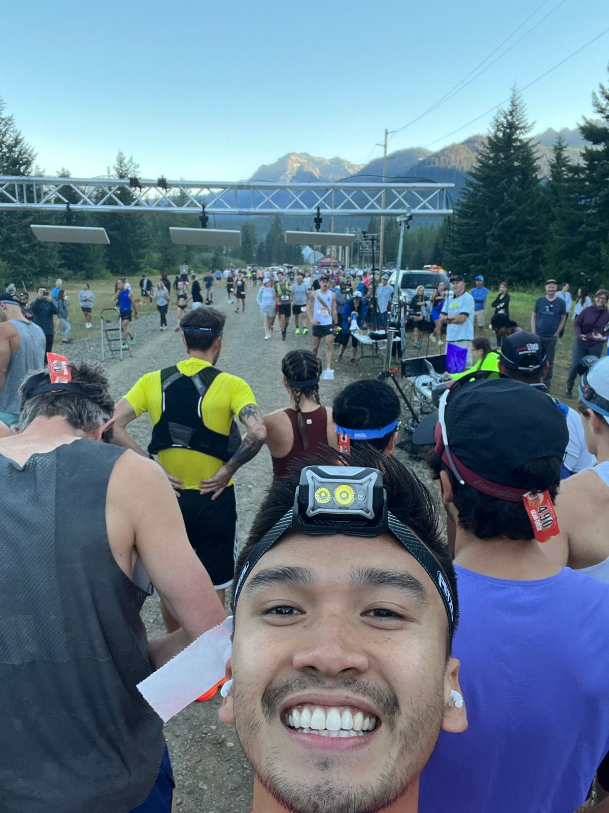
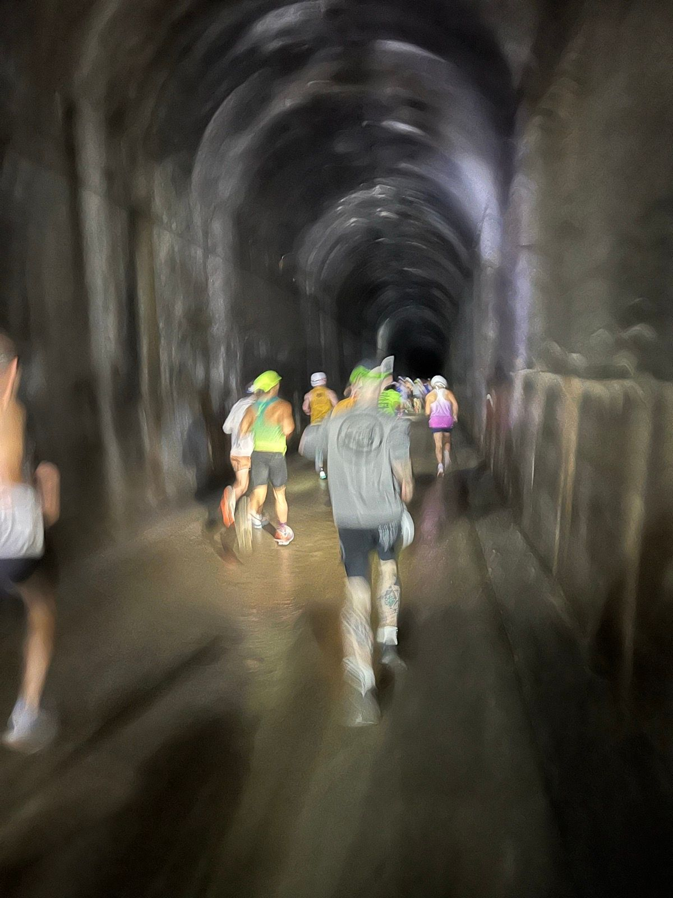
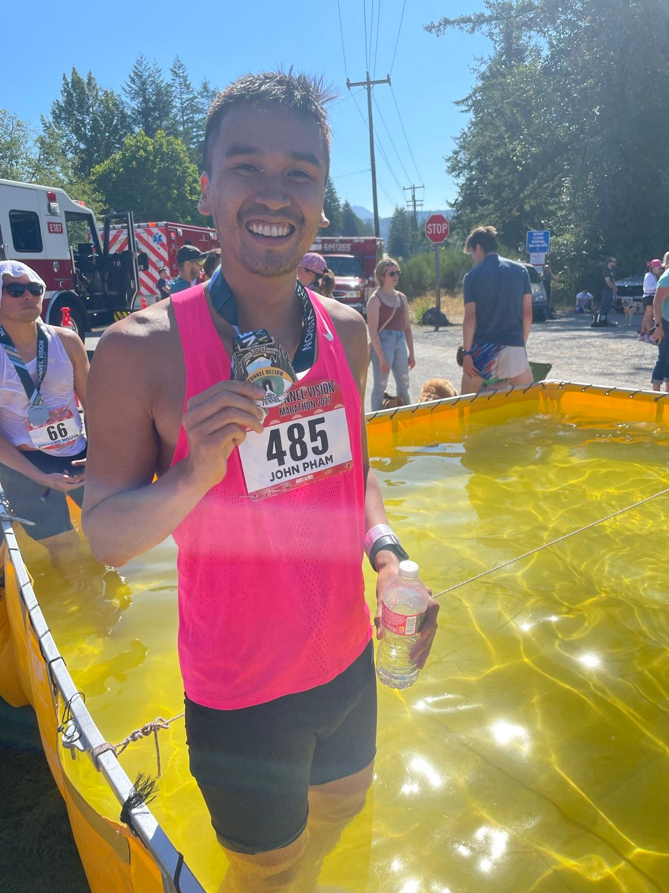

Title: Tunnel Marathon: BQ but not quite
Date: 2024-01-26
Category: BQ-Goals
Tags: Running, BQ, Tunnel Vision Marathon
Slug: Bq-but-not-quite
Authors: John Pham
Summary: The journey continues

The journey to qualifying for Boston continues into 2024.

A better late than never recap.

In August 2023, I ran the Tunnel Vision Marathon in Snoqualmie Washington. We stayed out in Washington for an extra week after a wedding,
and I heard that the course was a great BQ course: 2000 ft of net elevation loss and cool running temperatures. The downhill part
really helped the legs churning, but it ended up being an unseasonably hot day with temperatures in the high 70s and 80% rH. 
I finished with a 2:58:35, and I was over the moon going sub 3 in my first marathon. It took me a while to appreciate all this
as I sit crushing salt tablets with a cold towel under the medical tent along with a bunch of fellow runners. I eventually
made my way into the large dunk tank to cool off the legs. 

The course was an incredibly unique experience with views of the Washington mountains, an old 2 mile railroad tunnel illuminated
by runner headlamps, and the sound of packed gravel crunching beneath your feet. It was an incredibly small race with sparse crowd support throughout, but there was something
very comforting about dumping your race bag on a tarp and then lining up for 26.6 miles without going through security or
hoards of people. What a contrast to even the smallest NYRR races in NYC. It also attracts an incredibly friendly
group of runners, volunteers, and fans! I couldn't recommend it enough especially if you're looking for something totally
different from a large road race.

Everything they say about the race starting at mile 20 is true. I don't think I've physically willed myself to do something
harder than the final 6 miles of the race especially after 24 mile never seemed to end (the marker was missing). I went
out too hot in the first half (1:27 split) and paid for it in the second half as the heat, dehydration, and fatigue caught up.
The shower and nap after the race - glorious! 

Unfortunately, the Boston Marathon had record applicants for its 2024 race. My time was not fast enough to get past the cutoff.
I actually wasn't even close (2:54:30ish) which made me feel better honestly. Seconds off would've killed me.
So revenge race in the 2024 spring to qualify again.

