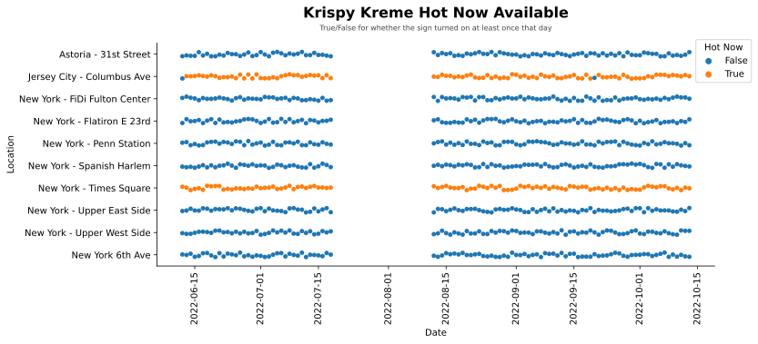

Title: Krispy Kreme is Never Hot
Date: 2022-10-13
Category: Projects
Tags: Scraper, Food, Krispy Kreme, Hot Now, Free
Slug: hot-now-krispy-kreme
Authors: John Pham
Summary: Krispy Kreme was offering free donuts, but the donuts are never hot now.

Desserts have never been a calling for me, but I've always had a soft spot for donuts (along with strawberry ice cream, carrot cake, and cheesecake).
NYC has some great donuts (shout-out to the tres leche donut at Doughnut Plant), but I'm a secret for the sweet familiarity of a classic warm glazed donut from
Krispy Kreme. When I heard that Krispy Kreme was giving away free donuts when their iconic Hot Now signs turned on, I was ready to eat load up -- we recently moved close by the Flatiron location.

<blockquote class="twitter-tweet">
BIG NEWS! 🔥🍩 Starting today, anytime our iconic Hot Light is on, you can enjoy one FREE Hot Original Glazed doughnut at participating US &amp; CAN <a href="https://twitter.com/hashtag/KrispyKreme?src=hash&amp;ref_src=twsrc%5Etfw">#KrispyKreme</a> shops ALL summer thru 9/5! With all that’s going on in the world, a free treat is the sweetest treat! <a href="https://t.co/LJmDXGTqBH">pic.twitter.com/LJmDXGTqBH</a>
&mdash; Krispy Kreme (@krispykreme) <a href="https://twitter.com/krispykreme/status/1534647155645894656?ref_src=twsrc%5Etfw">June 8, 2022</a></blockquote> 
<blockquote class="twitter-tweet">
A red <a href="https://twitter.com/hashtag/HotLight?src=hash&amp;ref_src=twsrc%5Etfw">#HotLight</a> means one hot &amp; FREE Original Glazed doughnut! 🔥 <a href="https://t.co/87zLfO92Tp">pic.twitter.com/87zLfO92Tp</a>
&mdash; Krispy Kreme (@krispykreme) <a href="https://twitter.com/krispykreme/status/1558830858756411393?ref_src=twsrc%5Etfw">August 14, 2022</a></blockquote> 
<blockquote class="twitter-tweet">
Hot 👏 Fresh 👏 FREE 👏   Enjoy one iconic Original Glazed doughnut anytime the <a href="https://twitter.com/hashtag/HotLight?src=hash&amp;ref_src=twsrc%5Etfw">#HotLight</a> is on at participating US Krispy Kreme shops ALL summer thru 9/5!🔥 <a href="https://t.co/4vnkbDCgkN">pic.twitter.com/4vnkbDCgkN</a>
&mdash; Krispy Kreme (@krispykreme) <a href="https://twitter.com/krispykreme/status/1539969618420199425?ref_src=twsrc%5Etfw">June 23, 2022</a></blockquote> 

The donut lover that I am immediately realized that I could create my own alert that would check to see when the Hot Now sign would turn on at the Flatiron location.
Krispy Kreme's store locator website has indicator that shows when the Hot Now sign is turned on. So I created a service that would run every 8 mins and send me a text message saying "HOT NOW!".
To my dismay, I had received no salacious text messages suggestive of a Hot encounter -- it turns out that the Flatiron location never turned on their light even though they claim it happens twice a day.

I would know because I logged every attempt to check (except when the VPS went offline for a month when it ran out of memory oops)

So it turns out there are many locations in Manhattan that never turn on except for Times Square which upon further review of the data, never turns off. Every single run says Times Square is Hot Now.
I like donuts, but I'm not taking myself out of the way to Times Square. I also thought it might've been them purposely avoiding the promotional period (06/08 - 09/05), but this pattern persists well after 09/05.
Perhaps there's a strong asterisk on _participating locations_, but this feels downright deceptive!

