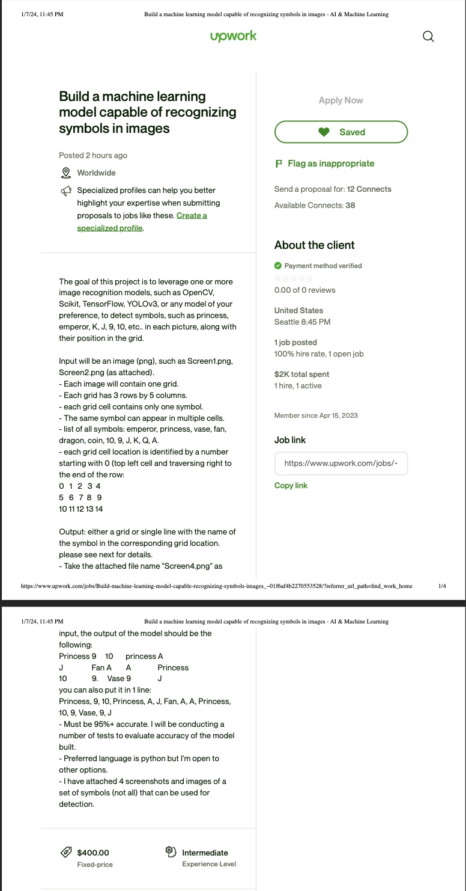
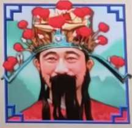
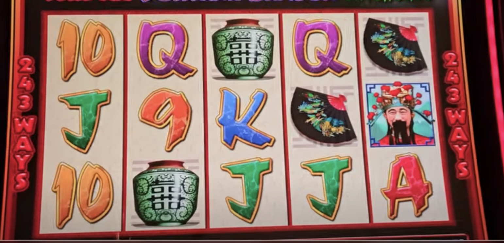
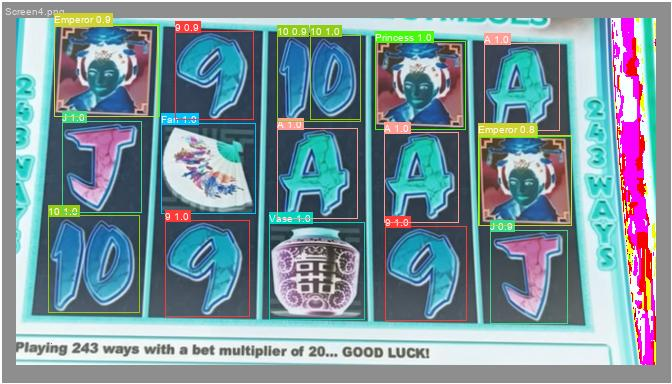

Title: Upwork Image Recognition
Date: 2024-02-04
Category: Projects
Tags: Data, Scraping, Image Recognition
Slug: up-work
Authors: John Pham
Summary: Learning Image Recognition Framework

Like all other technologists, I share the dream of building something or finding a side hustle
towards the goal of financial freedom. The common adage is to find problems, solve them, and the money follows.
So in search of these problems, I created an Upwork account to find job listings.

Most listings were uninspiring. 90% of jobs wanted web scrapers that rotated IPs to get around
banning, and others wanted to pay $5 an hour for a 10x, business revolutionizing engineer.
I wanted to find a well-scoped and tractable problem to tackle and stumbled upon a request for an image recognition task.

My previous experience with CV models have been primarily for classification purposes, so I thought this would be
a fun opportunity to learn something new. So the provided training data consisted of
single icon images like this:

And then composite images that almost looked like a slot machine.

Given my rather uninitiated knowledge of object recognition, I googled the best frameworks
for these problems. I landed on https://yolov8.com/ which seemed promising given its popularity in searches, and it
appeared to outperform other methods while still being actively developed. 

The main problem is that the sample job listing provided such few images for training. We ultimately wanted objection
recognition on the screen images and then a print out of the objects list. 

I was only provided 4 screen images and a handful of images with singular icons.
I wanted to keep 2 images for training, 1 for validation (parameter fine-tuning), and 1 for holdout testing.
So I carefully selected the 2 screen images for training that had each possible icon and took screenshots of each icon within the images.
I did the same for the image in the validation set. I then used labelimg to label the images within the separate screenshots,
and then also to label each icon in the holistic screen images. We initiated the model from the base yolov8s model and fine-tuned the model
on the available image set. The result on the holdout test image was promising. I'm not sure of the image post-processing that made it appear
more like a negative, but it worked reasonably well.

This was an interesting exercise in building an obviously overfit model for this specific task given
the really limited training data. I initially only trained the model on the few single icons for too few epochs, and it 
returned nothing. However, it improved once I added the additional screenshotted icons from the screen composites. I
also managed to improve performance by reducing the transformations. Typically, we want to transform the objects via
rotation, reflection, etc. to prevent overwriting. But I knew additional constraints of the task such as the fact that we
would never pass an upside or reflected "princess" image. It was a quick and nifty project that I can see actually being
useful to know in the future.